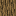
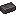
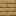

# Popular Minecraft Textures

This repository contains 19 of the most popular and iconic Minecraft textures, along with their 32x32 color maps in JSON format.

## Texture List

| Texture Name | Preview | Color Map (JSON) |
|--------------|---------|------------------|
| TNT |  | [tnt_side.json](color_maps/tnt_side.json) |
| Oak Log |  | [oak_log.json](color_maps/oak_log.json) |
| Stone |  | [stone.json](color_maps/stone.json) |
| Diamond |  | [diamond.json](color_maps/diamond.json) |
| Netherite Ingot |  | [netherite_ingot.json](color_maps/netherite_ingot.json) |
| Grass Block |  | [grass_block_top.json](color_maps/grass_block_top.json) |
| Dirt |  | [dirt.json](color_maps/dirt.json) |
| Cobblestone |  | [cobblestone.json](color_maps/cobblestone.json) |
| Oak Planks |  | [oak_planks.json](color_maps/oak_planks.json) |
| Crafting Table |  | [crafting_table_top.json](color_maps/crafting_table_top.json) |
| Iron Ingot |  | [iron_ingot.json](color_maps/iron_ingot.json) |
| Gold Ingot |  | [gold_ingot.json](color_maps/gold_ingot.json) |
| Apple |  | [apple.json](color_maps/apple.json) |
| Bread |  | [bread.json](color_maps/bread.json) |
| Iron Sword |  | [iron_sword.json](color_maps/iron_sword.json) |
| Diamond Pickaxe |  | [diamond_pickaxe.json](color_maps/diamond_pickaxe.json) |
| Torch |  | [torch.json](color_maps/torch.json) |
| Water Bucket |  | [water_bucket.json](color_maps/water_bucket.json) |
| Glass |  | [glass.json](color_maps/glass.json) |

## JSON Color Map Format

Each JSON file in the `color_maps/` directory contains two parts:
1. **palette**: A mapping of letter aliases (A, B, C, etc.) to RGB hex color codes.
2. **pixel_map**: A 32x32 grid (array of arrays) of letter aliases representing the texture's pixels.

All textures have been upscaled to 32x32 using nearest-neighbor interpolation to preserve the pixelated look.
