# Popular Minecraft Textures

This repository contains 20 of the most popular and iconic Minecraft textures, along with their 32x32 color maps in JSON format and "Paint by Numbers" PDFs.

You can view an interactive preview of these textures on the [GitHub Pages site](https://chatelao.github.io/minecraft-led-panel-and-cube/).

## Texture List

| Texture Name | Preview | Color Map (JSON) | Paint by Numbers |
|--------------|---------|------------------|-------------------|
| TNT |  | [tnt_side.json](color_maps/tnt_side.json) | [tnt_side.pdf](paint_by_numbers/tnt_side.pdf) |
| Oak Log | 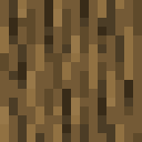 | [oak_log.json](color_maps/oak_log.json) | [oak_log.pdf](paint_by_numbers/oak_log.pdf) |
| Stone | 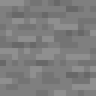 | [stone.json](color_maps/stone.json) | [stone.pdf](paint_by_numbers/stone.pdf) |
| Diamond | 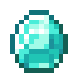 | [diamond.json](color_maps/diamond.json) | [diamond.pdf](paint_by_numbers/diamond.pdf) |
| Netherite Ingot | 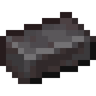 | [netherite_ingot.json](color_maps/netherite_ingot.json) | [netherite_ingot.pdf](paint_by_numbers/netherite_ingot.pdf) |
| Grass Block | 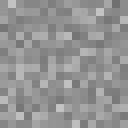 | [grass_block_top.json](color_maps/grass_block_top.json) | [grass_block_top.pdf](paint_by_numbers/grass_block_top.pdf) |
| Dirt | 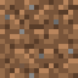 | [dirt.json](color_maps/dirt.json) | [dirt.pdf](paint_by_numbers/dirt.pdf) |
| Cobblestone | 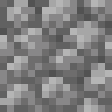 | [cobblestone.json](color_maps/cobblestone.json) | [cobblestone.pdf](paint_by_numbers/cobblestone.pdf) |
| Oak Planks | 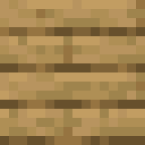 | [oak_planks.json](color_maps/oak_planks.json) | [oak_planks.pdf](paint_by_numbers/oak_planks.pdf) |
| Crafting Table |  | [crafting_table_top.json](color_maps/crafting_table_top.json) | [crafting_table_top.pdf](paint_by_numbers/crafting_table_top.pdf) |
| Iron Ingot | 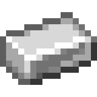 | [iron_ingot.json](color_maps/iron_ingot.json) | [iron_ingot.pdf](paint_by_numbers/iron_ingot.pdf) |
| Gold Ingot | 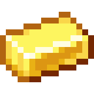 | [gold_ingot.json](color_maps/gold_ingot.json) | [gold_ingot.pdf](paint_by_numbers/gold_ingot.pdf) |
| Apple | 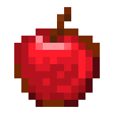 | [apple.json](color_maps/apple.json) | [apple.pdf](paint_by_numbers/apple.pdf) |
| Bread | 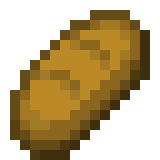 | [bread.json](color_maps/bread.json) | [bread.pdf](paint_by_numbers/bread.pdf) |
| Iron Sword | 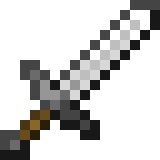 | [iron_sword.json](color_maps/iron_sword.json) | [iron_sword.pdf](paint_by_numbers/iron_sword.pdf) |
| Diamond Pickaxe | 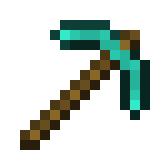 | [diamond_pickaxe.json](color_maps/diamond_pickaxe.json) | [diamond_pickaxe.pdf](paint_by_numbers/diamond_pickaxe.pdf) |
| Torch | 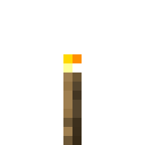 | [torch.json](color_maps/torch.json) | [torch.pdf](paint_by_numbers/torch.pdf) |
| Water Bucket | 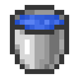 | [water_bucket.json](color_maps/water_bucket.json) | [water_bucket.pdf](paint_by_numbers/water_bucket.pdf) |
| Glass | 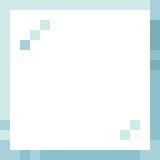 | [glass.json](color_maps/glass.json) | [glass.pdf](paint_by_numbers/glass.pdf) |
| Matrix |  | [matrix.json](color_maps/matrix.json) | [matrix.pdf](paint_by_numbers/matrix.pdf) |

## JSON Color Map Format

Each JSON file in the `color_maps/` directory contains two parts:
1. **palette**: A mapping of letter aliases (A, B, C, etc.) to RGB hex color codes.
2. **pixel_map**: A 32x32 grid (array of arrays) of letter aliases representing the texture's pixels.

All textures have been upscaled to 32x32 using nearest-neighbor interpolation to preserve the pixelated look.
